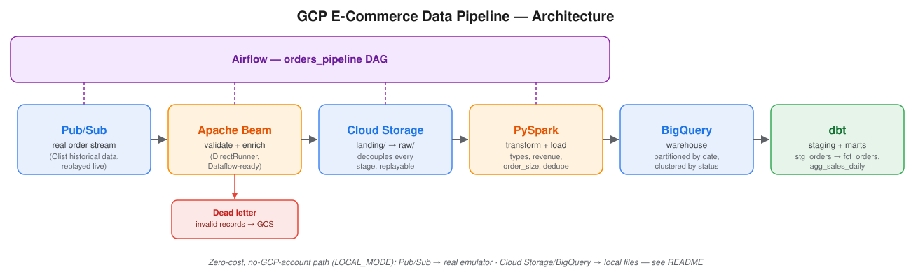

# GCP E-Commerce Data Engineering Pipeline

[](https://github.com/namanbhatia11466/gcp-ecommerce-de-pipeline/actions/workflows/ci.yml)

An end-to-end batch/streaming pipeline that takes real e-commerce order
data from a Pub/Sub feed all the way to analytics-ready BigQuery models —
built to show what a production-shaped GCP data stack actually looks like,
not just a toy ETL script.



## Why I built this

I wanted a project that exercises the actual GCP data engineering stack —
streaming ingestion, a validation/enrichment layer with proper fault
tolerance, a Spark transform, a partitioned warehouse, a modeling layer on
top of it, and orchestration tying it together — rather than a single
notebook that reads a CSV and calls it a pipeline. Each stage here is the
kind of thing you'd actually find in a real system: messages get
decoupled through Pub/Sub and GCS so any stage can be replayed
independently, bad records get quarantined instead of crashing the job,
and the warehouse table is partitioned and clustered with query cost in
mind.

It's also deliberately runnable by anyone reviewing it — see
[Try it yourself](#try-it-yourself-zero-setup) below — because a pipeline
that only works on the author's machine with the author's GCP billing
account isn't much of a demonstration.

## The dataset

This runs on real data: the [Olist Brazilian E-Commerce dataset](https://www.kaggle.com/datasets/olistbr/brazilian-ecommerce)
(Kaggle, CC-BY-NC-SA-4.0) — **~99,000 real orders placed on the Olist
marketplace between October 2016 and September 2018**, with linked
customers, products, payments, and delivery data. Olist connects small
Brazilian retailers to marketplaces; this is their real (anonymized)
order history, not a synthetic dataset generated to look plausible.

That distinction matters for what this project actually demonstrates.
Generated data is clean by construction — every field is well-formed,
every value is in range, because a script wrote it that way. Real data
isn't: orders arrive with missing `product_category` values, customers
with no state on file, payments split across multiple methods, order
grains that don't match a naive one-row-per-order assumption (an order
here can contain multiple distinct products — more on that below).
Handling that is the actual skill this pipeline exercises, and it's why I
moved off an earlier Faker-based version of this project to real data.

`ingestion/producer.py` joins the raw Olist tables (orders, order items,
payments, products, customers, category translations), collapses them to
one row per **(order, product)** line, and "replays" a random sample of
that real history as a live Pub/Sub feed — the same pattern you'd use to
backfill or load-test a streaming system against real historical traffic.

A full download is ~126MB and isn't committed to the repo; instead a
small **1,000-order sample carved from the real data** (~556KB, still 100%
real Olist records, not synthetic) ships in `data/sample/olist/`, so the
pipeline runs immediately with no download and no Kaggle account. Want
the full ~99k-order run:

```bash
pip install kaggle   # needs a Kaggle API token, see kaggle.com/settings
kaggle datasets download -d olistbr/brazilian-ecommerce -p data/raw/olist --unzip
```

`producer.py` prefers `data/raw/` and falls back to the sample
automatically — no flag to flip.

## Architecture

| Stage | File | What it does |
|---|---|---|
| Ingestion | `ingestion/producer.py` | Samples real Olist orders, publishes to Pub/Sub |
| Landing | `scripts/pull_messages.py` | Pulls messages from Pub/Sub, lands them in GCS |
| Processing | `pipeline/beam_pipeline.py` | Validates + enriches via Apache Beam; bad records → dead letter |
| Transform | `spark/transform.py` | PySpark cleans, types, derives metrics, loads to BigQuery |
| Modeling | `dbt_project/` | Staging + marts models on top of the raw BigQuery table |
| Orchestration | `airflow/dags/orders_pipeline_dag.py` | Chains ingestion → landing → processing → transform |

**GCP services**: Pub/Sub (real-time ingestion) · Cloud Storage (data lake,
raw + processed) · Apache Beam on DirectRunner (validation/enrichment,
Dataflow-ready) · PySpark (batch transform + BigQuery load) · BigQuery
(warehouse, partitioned by `order_date`, clustered by `status, product_id`).

## Try it yourself (zero setup)

No GCP account, no billing, no credentials — this runs entirely on your
machine using a real Pub/Sub emulator and local storage standing in for
GCS/BigQuery:

```bash
git clone https://github.com/namanbhatia11466/gcp-ecommerce-de-pipeline.git
cd gcp-ecommerce-de-pipeline
python -m venv venv && venv\Scripts\activate   # Windows; source venv/bin/activate on Mac/Linux
pip install -r requirements.txt

make local-up       # starts the Pub/Sub emulator, provisions topic/subscription
make run-all-local  # producer -> pull -> beam -> spark, real Olist data throughout
```

Output lands in `data/gcs/` (landing/raw/dead-letter, standing in for the
bucket) and `data/warehouse/orders/` (partitioned Parquet, standing in for
BigQuery) — inspect it directly, no cloud console needed.

`make` isn't installed in every shell (e.g. plain Git Bash on Windows) —
if it's missing, run the `python ...` commands from the Makefile directly
with `LOCAL_MODE=true` set, or use WSL/a container.

## Running against real GCP

```bash
# 1. GCP setup: create a project, a Pub/Sub topic/subscription, a GCS
#    bucket, a BigQuery dataset, and a service account key -> ./key.json
cp .env.example .env   # fill in GCP_PROJECT_ID, GCP_BUCKET_NAME, BQ_RAW_DATASET, etc.

# 2. Run the stages
python ingestion/producer.py --num-events 20
python scripts/pull_messages.py
python pipeline/beam_pipeline.py
python spark/transform.py

# 3. Build the warehouse models
export DBT_PROFILES_DIR=dbt_project   # Windows: set DBT_PROFILES_DIR=dbt_project
dbt deps --project-dir dbt_project
dbt run --project-dir dbt_project
dbt test --project-dir dbt_project
```

Or orchestrate steps 1–4 as the `orders_pipeline` Airflow DAG:
`docker compose up -d`, then trigger it from `localhost:8080`.

## Key design decisions

- **DirectRunner over DataflowRunner** — the Beam pipeline runs locally at
  zero cost; the same code is Dataflow-ready for a production streaming
  deployment (swap the runner, not the logic).
- **GCS as an intermediate layer** — decouples ingestion from processing
  and lets any landing batch be replayed independently.
- **Dead-letter pattern** — malformed or invalid orders get routed to a
  separate path instead of failing the whole batch. Verified with a real
  malformed message during testing, not just written and assumed correct.
- **BigQuery partitioned by `order_date`, clustered by `status,
  product_id`** — real historical dates (2016–2018) from the source data,
  so partitioning actually does something meaningful on this dataset,
  unlike a synthetic feed where every row lands on "today."
- **`(order_id, product_id)` as the real grain, not `order_id` alone** —
  Olist orders can contain multiple products, so `order_id` isn't unique
  downstream. This surfaced a real bug while migrating off the old
  synthetic data: Spark's dedup step (`dropDuplicates(["order_id"])`)
  would have silently discarded legitimate order lines. Fixed to dedupe
  on the composite key, and the dbt uniqueness test enforces it going
  forward (`dbt_utils.unique_combination_of_columns`).
- **`value_tier` thresholds calibrated to the real data**, not round
  numbers — the amount distribution has a median of ~R$81 and a 90th
  percentile of ~R$255, so "high value" is `>= R$250`, not an arbitrary
  `>= $1000` that would leave the tier almost empty.
- **LOCAL_MODE isn't a blanket "swap every service for an emulator"** —
  Pub/Sub has a real, fully compatible emulator, so that one's emulated
  properly. GCS and BigQuery don't have emulators that hold up under this
  pipeline's actual usage (Beam's batch rename API, Spark's BigQuery
  Storage Write connector), so LOCAL_MODE swaps those for local files
  instead of pretending an imperfect emulator is production-equivalent.

## What's actually verified

Being specific about what's been run versus what's architecturally
correct but unexercised:

- **LOCAL_MODE**: run end-to-end multiple times with real Olist data —
  published → pulled → validated/enriched (including a deliberately
  malformed message, correctly routed to dead-letter) → transformed →
  Parquet output read back with correct values.
- **Airflow**: the custom Docker image (JDK added for PySpark, since the
  base Airflow image has none) builds clean, the `orders_pipeline` DAG
  loads with zero import errors, and a real `SparkSession` starts and
  runs inside the live scheduler container.
- **dbt**: the full project (`stg_orders`, `fct_orders`, `agg_sales_daily`,
  the composite uniqueness test) parses cleanly against a real BigQuery
  project configuration.
- **Real GCP**: run once end-to-end against a live project. Not kept
  running continuously — see `LOCAL_MODE` above for why that's a
  deliberate choice rather than a gap.
- **CI**: every push/PR to `main` lints (`ruff`), runs the `pytest` suite,
  runs `dbt parse` against the full project, and runs the *entire*
  LOCAL_MODE pipeline end-to-end (real emulator, real bundled Olist sample
  data, real Parquet output checked for actual rows) — not just a lint
  pass. See `.github/workflows/ci.yml`.
- **Tests**: `tests/` covers `ValidateAndEnrich`'s dead-letter routing and
  `value_tier` thresholds, plus `producer.py`'s order-collapsing logic —
  the exact area a real bug lived in during the Olist migration (see
  design decisions above). That specific test was checked against a
  reintroduced version of the bug and confirmed it actually fails, not
  just written and assumed to catch it.

## Cost

LOCAL_MODE: **$0**, no GCP account required. Against real GCP: BigQuery
and GCS usage stays within the always-free tier for a project at this
scale.

## Roadmap

- [x] Airflow DAG for end-to-end orchestration
- [x] dbt models for warehouse modeling
- [x] Real dataset (Olist) instead of synthetic data
- [x] Zero-cost local demo mode (LOCAL_MODE)
- [x] GitHub Actions CI/CD pipeline
- [ ] Dataflow deployment for production streaming

## Project structure

```
gcp-ecommerce-de-pipeline/
├── ingestion/           # Pub/Sub producer (real Olist data)
├── pipeline/            # Apache Beam validation/enrichment
├── scripts/             # pull_messages, local_setup, build_local_sample
├── spark/               # PySpark transform + load
├── airflow/dags/        # orders_pipeline DAG
├── dbt_project/         # staging + marts models
├── data/sample/olist/   # committed real-data sample (1,000 orders)
├── tests/               # pytest - beam validation, producer grain logic
├── docs/architecture.svg
├── .github/workflows/   # CI: lint, tests, dbt parse, full LOCAL_MODE run
├── docker-compose.yml   # Airflow + Spark + LOCAL_MODE emulators
└── requirements.txt / requirements-dev.txt
```

## License / attribution

Pipeline code is [MIT licensed](LICENSE). The dataset is the [Olist
Brazilian E-Commerce dataset](https://www.kaggle.com/datasets/olistbr/brazilian-ecommerce),
© Olist, licensed CC-BY-NC-SA-4.0 (non-commercial) — used here for
educational/portfolio purposes; the committed sample in
`data/sample/olist/` carries the same license.
